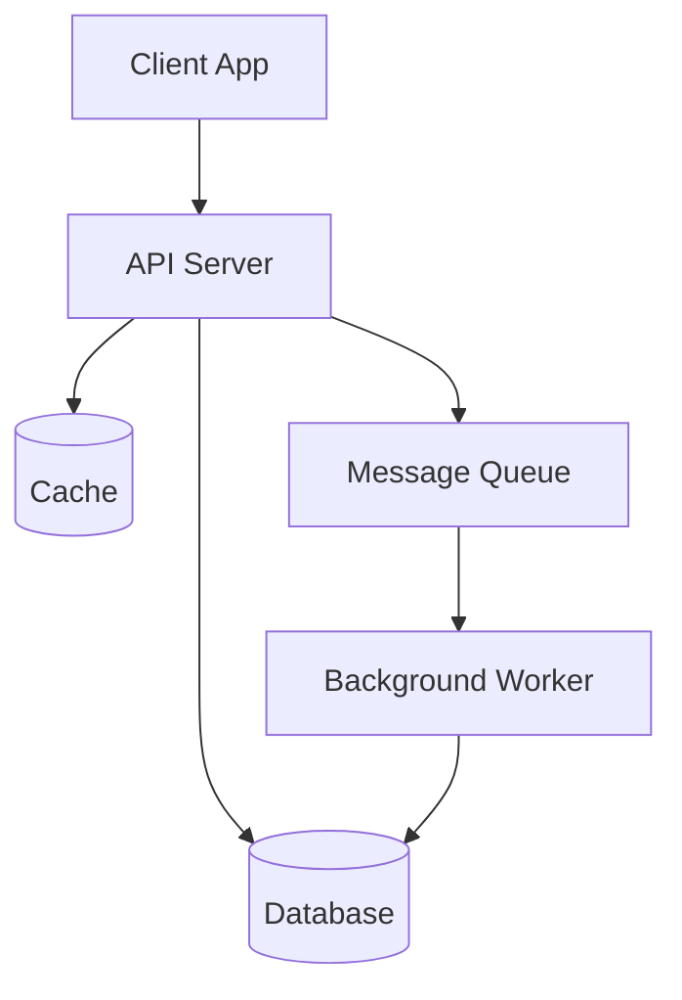
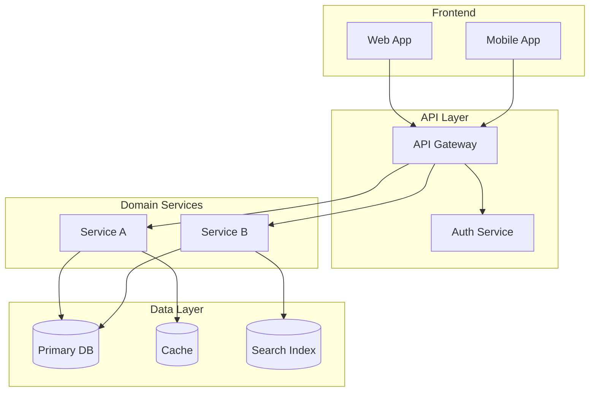
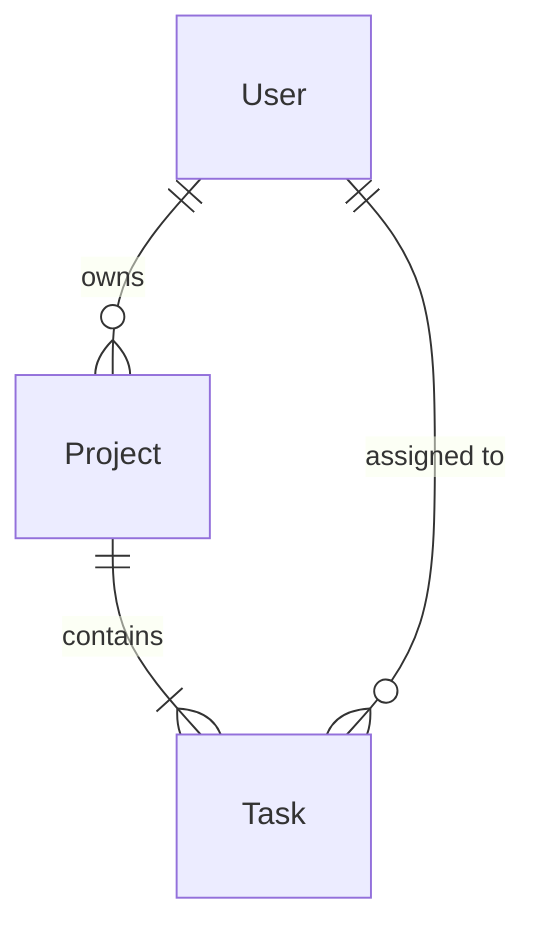
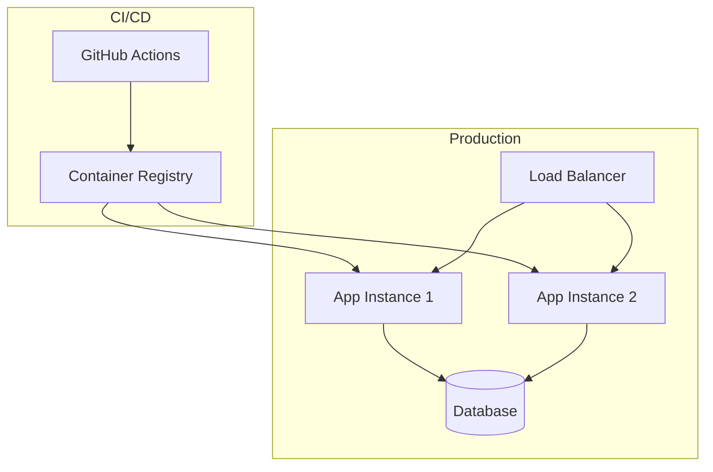

# Technical Architecture Documentation

## **TRIGGER KEYWORD: `make_techdocs`**

When the user types "make_techdocs" (with or without additional context), execute the technical documentation creation and update workflow below. The goal is to create and maintain a living, VitePress-compatible technical architecture documentation set that captures the accumulated design knowledge across all requirements and planning phases.

## **TRIGGER KEYWORD: `review_techdocs`**

When the user types "review_techdocs", perform a health check on the existing technical documentation — checking for staleness, missing sections, inconsistencies with the actual codebase, and gaps in architecture decision records. Produces a diagnostic report.

---

## **What This Is (and What It Is NOT)**

| This Document Covers | This Document Does NOT Cover |
|---|---|
| **Technical/architectural documentation** for developers inheriting, maintaining, or extending the system | **Product documentation** for end-users (how to use, configure, or administer the product) |
| System architecture, design decisions, data models, API contracts, infrastructure | User guides, tutorials, FAQ, release notes, marketing pages |
| Developer onboarding, development workflow, deployment procedures | Feature announcements, changelogs for users |

**Product documentation** is a separate concern. If the project needs user-facing docs, the developer should request it explicitly during `make_requirements` or `make_plan`. Product docs live in a separate directory (e.g., `docs/product/` or `user-guide/`) and are NOT governed by this protocol.

---

## **Opt-In, Then Auto-Update**

Technical documentation is **not mandatory by default**, but once opted in, it is **automatically maintained**.

### Detection & Opt-In Protocol

```
┌─────────────────────────────────────────────────────────┐
│  Agent completes exec_plan or make_requirements         │
│                                                         │
│  Does docs/index.md exist (with techdocs frontmatter)?  │
│  ┌─────┐       ┌──────┐                                │
│  │ YES │       │  NO  │                                 │
│  └──┬──┘       └──┬───┘                                │
│     │             │                                     │
│     ▼             ▼                                     │
│  Auto-update   Ask user:                                │
│  techdocs      "Would you like to create technical      │
│                 architecture docs for this project?"     │
│                 ┌─────┐       ┌──────┐                  │
│                 │ YES │       │  NO  │                  │
│                 └──┬──┘       └──┬───┘                  │
│                    │             │                       │
│                    ▼             ▼                       │
│                 Run            Skip                     │
│                 make_techdocs  (don't ask again          │
│                                until next plan)          │
└─────────────────────────────────────────────────────────┘
```

### How to Detect Opt-In

The presence of `docs/index.md` with the following frontmatter marker indicates techdocs are active:

```yaml
---
techdocs: true
---
```

If `docs/index.md` exists but lacks this marker, it is NOT a techdocs-managed file — do not auto-update.

### Auto-Update Triggers

Once techdocs are opted in (the marker exists), the agent MUST update them at these checkpoints:

| Trigger | Update Type | What to Update |
|---------|-------------|----------------|
| **Phase completion** (during `exec_plan`) | Incremental | New ADRs for decisions made, updated sections if architecture changed |
| **Plan completion** (all `exec_plan` tasks done) | Comprehensive | Full review of all sections, ensure consistency, update diagrams |
| **`make_requirements` completion** | Incremental | New design decisions, updated scope, new integration points |
| **Manual `make_techdocs`** | Comprehensive | Full review and regeneration of all sections |

**Incremental update** = Quick pass — add new ADRs, update changed sections only.
**Comprehensive update** = Full pass — review every section against actual codebase state.

---

## **Relationship to Other Protocols**

| Protocol | Relationship |
|----------|-------------|
| `make_requirements` | **Upstream.** Requirements define WHAT to build. Techdocs capture the architectural decisions made DURING requirements discovery. After `make_requirements` completes → update techdocs. |
| `make_plan` | **Parallel.** Plans define HOW to build a specific feature. Techdocs capture the SYSTEM-LEVEL architecture that spans across features. `make_plan` should READ techdocs as context input. |
| `exec_plan` | **Downstream.** During execution, architecture may evolve. After each phase → incremental techdocs update. After plan completion → comprehensive update. |
| `retro_requirements` | **Upstream.** When reverse-engineering an existing system, techdocs capture the discovered architecture. |

### How `make_plan` Uses Techdocs

When `make_plan` starts and `docs/index.md` (with techdocs marker) exists:

1. Read the architecture overview and relevant sections
2. Use current architecture as context for planning (understand existing patterns, conventions, integration points)
3. Reference techdocs in plan documents where relevant (e.g., "See architecture docs for data model")

---

## **Phase 1: Initial Creation (`make_techdocs`)**

### 1.1 Information Gathering

When running `make_techdocs` for the first time, gather information from:

1. **Existing requirements** — Read `requirements/` if it exists
2. **Existing plans** — Read `plans/*/` if they exist
3. **Current codebase** — Analyze source code structure, patterns, dependencies
4. **`.clinerules/project.md`** — Read project configuration
5. **User input** — Ask clarifying questions about architecture intent

If `make_techdocs` is run after `make_requirements` or `exec_plan`, much of this information is already available from the preceding session.

### 1.2 Ask Clarifying Questions (First Run Only)

If no requirements or plans exist yet, ask:

1. **System purpose** — What does this system do at a high level?
2. **Key stakeholders** — Who are the developers? What's their experience level?
3. **Architecture style** — Monolith, microservices, serverless, hybrid?
4. **Key integrations** — What external systems does this connect to?
5. **Deployment model** — Cloud, on-prem, containerized, serverless?

If requirements/plans exist, extract this from existing documents — don't re-ask.

---

## **Phase 2: Document Structure**

### 2.1 Directory Layout

Create the documentation in the project's `docs/` directory with VitePress-compatible structure:

```
docs/
├── .vitepress/
│   └── config.ts                # VitePress configuration (auto-generated)
├── index.md                     # System overview & architecture summary (ENTRY POINT)
├── architecture/
│   ├── system-overview.md       # High-level architecture, component diagram
│   ├── data-model.md            # Domain model, entity relationships, schemas
│   ├── api-design.md            # API contracts, endpoints, protocols
│   ├── infrastructure.md        # Deployment, Docker, CI/CD, networking
│   └── security.md              # Security architecture, threat model
├── decisions/
│   ├── index.md                 # Architecture Decision Record log (chronological)
│   ├── ADR-001-[short-name].md  # Individual decision records
│   ├── ADR-002-[short-name].md
│   └── ...
├── guides/
│   ├── getting-started.md       # Developer setup, prerequisites, first run
│   ├── development.md           # Dev workflow, coding patterns, conventions
│   └── deployment.md            # How to deploy, environments, configuration
└── reference/
    ├── configuration.md         # All config options, env vars, feature flags
    └── integrations.md          # External system connections, protocols, auth
```

### 2.2 Adapting to Project Type

Not all projects need all sections. Adapt the structure:

| Project Type | Required Sections | Optional Sections |
|---|---|---|
| **Web App / SaaS** | All sections | — |
| **API / Backend** | system-overview, data-model, api-design, security, infrastructure | — |
| **Library / SDK** | system-overview, api-design, getting-started, development | data-model, infrastructure |
| **CLI Tool** | system-overview, getting-started, development | data-model, infrastructure |
| **Microservices** | All sections (especially infrastructure, integrations) | — |
| **Mobile App** | system-overview, data-model, api-design, security | infrastructure |
| **Infrastructure** | system-overview, infrastructure, security, deployment | data-model, api-design |

**Rule:** Create only the sections that are relevant. Empty placeholder sections add noise, not value. If a section isn't applicable, don't create the file.

---

## **Phase 3: VitePress Setup**

### 3.1 Initialize VitePress

Install VitePress as a dev dependency using the project's package manager:

```bash
# npm
npm install -D vitepress

# yarn
yarn add -D vitepress

# pnpm
pnpm add -D vitepress
```

### 3.2 VitePress Configuration

Generate `.vitepress/config.ts` based on the actual documentation structure:

```typescript
import { defineConfig } from 'vitepress'

export default defineConfig({
  title: '[Project Name] — Technical Documentation',
  description: 'Architecture documentation for [Project Name]',

  themeConfig: {
    nav: [
      { text: 'Architecture', link: '/architecture/system-overview' },
      { text: 'Decisions', link: '/decisions/' },
      { text: 'Guides', link: '/guides/getting-started' },
      { text: 'Reference', link: '/reference/configuration' },
    ],

    sidebar: [
      {
        text: 'Overview',
        items: [
          { text: 'Introduction', link: '/' },
        ],
      },
      {
        text: 'Architecture',
        items: [
          { text: 'System Overview', link: '/architecture/system-overview' },
          { text: 'Data Model', link: '/architecture/data-model' },
          { text: 'API Design', link: '/architecture/api-design' },
          { text: 'Infrastructure', link: '/architecture/infrastructure' },
          { text: 'Security', link: '/architecture/security' },
        ],
      },
      {
        text: 'Decisions',
        items: [
          { text: 'Decision Log', link: '/decisions/' },
          // Individual ADRs are listed dynamically or manually added
        ],
      },
      {
        text: 'Developer Guides',
        items: [
          { text: 'Getting Started', link: '/guides/getting-started' },
          { text: 'Development Workflow', link: '/guides/development' },
          { text: 'Deployment', link: '/guides/deployment' },
        ],
      },
      {
        text: 'Reference',
        items: [
          { text: 'Configuration', link: '/reference/configuration' },
          { text: 'Integrations', link: '/reference/integrations' },
        ],
      },
    ],

    socialLinks: [
      // { icon: 'github', link: 'https://github.com/...' },
    ],
  },
})
```

**Rule:** The sidebar MUST only include sections that actually exist. Remove entries for sections that were skipped per the project type adaptation table.

### 3.3 Package.json Scripts

Add documentation scripts to the project's `package.json`:

```json
{
  "scripts": {
    "docs:dev": "vitepress dev docs",
    "docs:build": "vitepress build docs",
    "docs:preview": "vitepress preview docs"
  }
}
```

### 3.4 Gitignore

Add VitePress build output to `.gitignore`:

```
docs/.vitepress/dist
docs/.vitepress/cache
```

---

## **Phase 4: Document Templates**

### 4.1 `docs/index.md` — System Overview (Entry Point)

This is the root document and the techdocs opt-in marker.

```markdown
---
techdocs: true
---

# [Project Name] — Technical Architecture

> **Project**: [Project Name]
> **Type**: [SaaS / API / Library / CLI / etc.]
> **Tech Stack**: [Key technologies]
> **Last Updated**: [YYYY-MM-DD]

---

## System Purpose

[2-3 paragraphs: What this system does, who it's for, and why it exists.
Written for a developer who has never seen the project before.]

## Architecture at a Glance

[High-level architecture diagram using text/mermaid:]



## Key Components

| Component | Technology | Purpose | Documentation |
|-----------|-----------|---------|---------------|
| [Component] | [Tech] | [Purpose] | [Link to detail doc] |

## Technology Decisions

See [Architecture Decision Records](/decisions/) for the rationale behind all major
technology and design choices.

## Getting Started

New to the project? Start with the [Getting Started Guide](/guides/getting-started).
```

---

### 4.2 `docs/architecture/system-overview.md` — System Architecture

```markdown
# System Overview

> **Last Updated**: [YYYY-MM-DD]

## Architecture Style

[Describe the overall architecture: monolith, microservices, serverless, event-driven, etc.
Explain WHY this style was chosen.]

## Component Architecture

[Detailed component diagram — more detailed than index.md]



## Component Responsibilities

### [Component Name]

- **Purpose**: [What it does]
- **Technology**: [What it's built with]
- **Inputs**: [What data/events it receives]
- **Outputs**: [What data/events it produces]
- **Dependencies**: [What it depends on]

[Repeat for each major component]

## Communication Patterns

| From | To | Protocol | Pattern | Notes |
|------|-----|----------|---------|-------|
| [Component] | [Component] | [REST/gRPC/Events/etc.] | [Sync/Async] | [Notes] |

## Cross-Cutting Concerns

- **Authentication**: [How auth works across the system]
- **Logging**: [Logging strategy and tools]
- **Monitoring**: [Monitoring approach]
- **Error Handling**: [System-wide error handling strategy]
```

---

### 4.3 `docs/architecture/data-model.md` — Data Model

```markdown
# Data Model

> **Last Updated**: [YYYY-MM-DD]

## Domain Model

[High-level entity relationship diagram]



## Entities

### [Entity Name]

| Field | Type | Constraints | Description |
|-------|------|------------|-------------|
| id | UUID | PK | Unique identifier |
| [field] | [type] | [constraints] | [description] |

**Relationships:**
- Has many [Related Entity] (via [foreign key])
- Belongs to [Related Entity] (via [foreign key])

**Business Rules:**
- [Rule 1]
- [Rule 2]

[Repeat for each entity]

## Data Flow

[Describe how data flows through the system — creation, transformation, storage, retrieval]

## Migration Strategy

[How database migrations are handled, tooling used, rollback procedures]
```

---

### 4.4 `docs/architecture/api-design.md` — API Design

```markdown
# API Design

> **Last Updated**: [YYYY-MM-DD]

## API Style

[REST / GraphQL / gRPC / mixed — and why]

## Authentication

[How API authentication works — JWT, API keys, OAuth, session tokens]

## Conventions

- **Base URL**: `[base url]`
- **Versioning**: [Strategy — URL path, header, query param]
- **Pagination**: [Strategy — cursor, offset, keyset]
- **Error Format**: [Standard error response shape]

## Endpoint Groups

### [Resource Group]

| Method | Endpoint | Description | Auth |
|--------|----------|-------------|------|
| GET | `/api/v1/[resource]` | List [resources] | [Required/Public] |
| POST | `/api/v1/[resource]` | Create [resource] | [Required/Public] |
| GET | `/api/v1/[resource]/:id` | Get [resource] | [Required/Public] |
| PUT | `/api/v1/[resource]/:id` | Update [resource] | [Required/Public] |
| DELETE | `/api/v1/[resource]/:id` | Delete [resource] | [Required/Public] |

[Repeat for each resource group]

## Error Handling

| Status Code | Meaning | Response Shape |
|-------------|---------|----------------|
| 400 | Bad Request | `{ error: string, details: [...] }` |
| 401 | Unauthorized | `{ error: string }` |
| 403 | Forbidden | `{ error: string }` |
| 404 | Not Found | `{ error: string }` |
| 500 | Internal Error | `{ error: string }` |

## Rate Limiting

[Rate limiting strategy, limits per endpoint category, response headers]
```

---

### 4.5 `docs/architecture/infrastructure.md` — Infrastructure

```markdown
# Infrastructure

> **Last Updated**: [YYYY-MM-DD]

## Deployment Architecture

[Deployment diagram — what runs where]



## Environments

| Environment | Purpose | URL | Infrastructure |
|-------------|---------|-----|---------------|
| Development | Local development | localhost:XXXX | Docker Compose |
| Staging | Pre-production testing | [URL] | [Platform] |
| Production | Live system | [URL] | [Platform] |

## Container Architecture

[Docker setup, base images, multi-stage builds, compose configuration]

## CI/CD Pipeline

[Pipeline stages, triggers, deployment strategy]

## Secrets Management

[How secrets are stored, rotated, and injected — NEVER list actual secrets]

## Backup & Recovery

[Backup strategy, recovery procedures, RPO/RTO targets]

## Monitoring & Alerting

[What is monitored, alerting thresholds, incident response]
```

---

### 4.6 `docs/architecture/security.md` — Security Architecture

```markdown
# Security Architecture

> **Last Updated**: [YYYY-MM-DD]
> **See also**: `code.md` rules 32-34 for implementation-level security standards

## Threat Model

[High-level threat model — what are we protecting, from whom?]

| Asset | Threat | Mitigation | Status |
|-------|--------|------------|--------|
| [Asset] | [Threat] | [How it's mitigated] | ✅ Implemented / ⏳ Planned |

## Authentication Architecture

[Auth flow, token lifecycle, session management]

## Authorization Model

[RBAC / ABAC / ACL — how permissions work]

| Role | Permissions | Scope |
|------|------------|-------|
| [Role] | [What they can do] | [Where it applies] |

## Data Protection

- **Encryption at rest**: [Strategy]
- **Encryption in transit**: [TLS configuration]
- **PII handling**: [What PII exists, how it's protected]
- **Data retention**: [Retention policies, deletion procedures]

## Input Validation & Injection Prevention

[System-wide input validation strategy, which libraries/frameworks handle this]

## Infrastructure Security

- **Container security**: [Non-root users, minimal images, vulnerability scanning]
- **Network security**: [Firewall rules, VPC, network segmentation]
- **Secrets management**: [Vault, env vars, CI/CD secrets — approach, not actual secrets]
- **Dependency management**: [Audit tools, update cadence, vulnerability response]
```

---

### 4.7 `docs/decisions/index.md` — Architecture Decision Record Log

```markdown
# Architecture Decision Records

This log tracks all significant architecture and design decisions made for [Project Name].
Each decision is documented with context, options considered, and rationale.

## Decision Log

| # | Date | Decision | Status |
|---|------|----------|--------|
| [ADR-001](ADR-001-short-name.md) | YYYY-MM-DD | [Brief title] | ✅ Accepted |
| [ADR-002](ADR-002-short-name.md) | YYYY-MM-DD | [Brief title] | ✅ Accepted |

## How to Read ADRs

Each ADR follows a standard format:
- **Context**: What situation or problem triggered this decision?
- **Decision**: What was decided?
- **Rationale**: Why was this chosen over alternatives?
- **Consequences**: What are the trade-offs and implications?

## When to Create an ADR

Create a new ADR when:
- Choosing a technology, framework, or library
- Deciding on an architecture pattern or style
- Choosing between multiple valid approaches
- Making a decision that would be hard to reverse
- Making a decision that future developers will question
```

---

### 4.8 ADR Template — `docs/decisions/ADR-XXX-[short-name].md`

```markdown
# ADR-XXX: [Decision Title]

> **Date**: YYYY-MM-DD
> **Status**: Proposed | Accepted | Deprecated | Superseded by [ADR-XXX]
> **Source**: [RD-XX / Plan: feature-name / Ad-hoc — where this decision originated]

## Context

[What is the situation? What problem or question triggered this decision?
Include technical context, constraints, and requirements.]

## Options Considered

### Option A: [Name]

- **Pros**: [advantages]
- **Cons**: [disadvantages]

### Option B: [Name]

- **Pros**: [advantages]
- **Cons**: [disadvantages]

### Option C: [Name] (if applicable)

- **Pros**: [advantages]
- **Cons**: [disadvantages]

## Decision

[What was decided? State it clearly in one sentence.]

**Chosen option**: [Option X], because [one-line rationale].

## Rationale

[Detailed explanation of why this option was chosen. Reference specific requirements,
constraints, or trade-offs that made this the best choice.]

## Consequences

### Positive

- [Benefit 1]
- [Benefit 2]

### Negative

- [Trade-off 1]
- [Trade-off 2]

### Risks

- [Risk and how it will be mitigated]
```

---

### 4.9 `docs/guides/getting-started.md` — Developer Getting Started

```markdown
# Getting Started

> **Last Updated**: [YYYY-MM-DD]

## Prerequisites

| Tool | Version | Installation |
|------|---------|-------------|
| [Tool] | [Version] | [Link or command] |

## Setup

### 1. Clone the Repository

```bash
git clone [repository-url]
cd [project-name]
```

### 2. Install Dependencies

```bash
[install command]
```

### 3. Configure Environment

```bash
cp .env.example .env
# Edit .env with your local configuration
```

### 4. Start Development

```bash
[dev start command]
```

### 5. Verify Setup

```bash
[verify/test command]
```

## Project Structure

```
[Directory tree with descriptions — keep synchronized with actual structure]
```

## Common Tasks

| Task | Command |
|------|---------|
| Run tests | `[command]` |
| Build | `[command]` |
| Lint | `[command]` |
| Database migration | `[command]` |

## Next Steps

- Read the [System Overview](/architecture/system-overview) to understand the architecture
- Review [Architecture Decisions](/decisions/) to understand why things are built this way
- Check the [Development Guide](/guides/development) for coding conventions
```

---

### 4.10 `docs/guides/development.md` — Development Workflow

```markdown
# Development Workflow

> **Last Updated**: [YYYY-MM-DD]

## Coding Conventions

[Project-specific conventions — naming, file organization, patterns used.
Reference .clinerules/project.md if it exists.]

## Branch Strategy

[Git workflow — trunk-based, GitFlow, feature branches, etc.]

## Testing Strategy

[How to write and run tests, what coverage is expected, test file organization]

## Code Review

[Code review process, what to look for, how to give/receive feedback]

## Common Patterns

### [Pattern Name]

[Description and code example of a common pattern used in this project]

[Repeat for each pattern]
```

---

### 4.11 `docs/guides/deployment.md` — Deployment Guide

```markdown
# Deployment

> **Last Updated**: [YYYY-MM-DD]

## Environments

| Environment | Branch | Auto-Deploy | URL |
|-------------|--------|-------------|-----|
| [Env] | [Branch] | [Yes/No] | [URL] |

## Deployment Process

### [Environment Name]

1. [Step 1]
2. [Step 2]
3. [Step 3]

## Configuration

[Environment-specific configuration, how to set environment variables]

## Rollback Procedure

[How to roll back a deployment if something goes wrong]

## Health Checks

[How to verify a deployment is healthy]
```

---

### 4.12 `docs/reference/configuration.md` — Configuration Reference

```markdown
# Configuration Reference

> **Last Updated**: [YYYY-MM-DD]

## Environment Variables

| Variable | Required | Default | Description |
|----------|----------|---------|-------------|
| `[VAR]` | [Yes/No] | [Default] | [Description] |

## Feature Flags

| Flag | Default | Description |
|------|---------|-------------|
| `[FLAG]` | [Value] | [Description] |

## Configuration Files

### [Config File Name]

[Description, location, format, key options]
```

---

### 4.13 `docs/reference/integrations.md` — External Integrations

```markdown
# External Integrations

> **Last Updated**: [YYYY-MM-DD]

## Integration Map

| System | Protocol | Direction | Purpose | Auth |
|--------|----------|-----------|---------|------|
| [System] | [REST/gRPC/SMTP/etc.] | [In/Out/Both] | [Purpose] | [Auth method] |

## [Integration Name]

### Overview

[What this integration does and why it exists]

### Configuration

[How to configure the integration — env vars, API keys, endpoints]

### Data Flow

[What data is exchanged, format, frequency]

### Error Handling

[What happens when the integration is unavailable, retry strategy]

### Testing

[How to test the integration locally — mocks, sandboxes, test accounts]
```

---

## **Phase 5: Authoring Guidelines**

### 5.1 Writing Style

Technical documentation must be:

- **Clear** — Written for a developer who has never seen the project. No assumed context.
- **Concise** — Say what needs to be said, nothing more. Prefer tables over paragraphs for structured data.
- **Current** — Every document has a "Last Updated" date. Stale docs are worse than no docs.
- **Concrete** — Include code examples, diagrams, and specific values. Avoid vague statements like "uses best practices."
- **Correct** — Every statement must reflect the actual codebase. Don't document aspirations as reality.

### 5.2 Diagrams

Use Mermaid syntax for diagrams — VitePress renders them natively:

- **Architecture diagrams**: `graph TB` or `graph LR`
- **Entity relationships**: `erDiagram`
- **Sequences**: `sequenceDiagram`
- **State machines**: `stateDiagram-v2`

### 5.3 Cross-Referencing

- Use relative links between documentation pages (e.g., `[System Overview](/architecture/system-overview)`)
- Reference ADRs by number when explaining design choices (e.g., "See [ADR-003](/decisions/ADR-003-chosen-database)")
- Link to source code files when documenting specific implementations

### 5.4 What NOT to Document

- **Secrets, credentials, or API keys** — Never. Not even examples that look real.
- **Auto-generated code** — Don't document what can be read from the code itself
- **Temporary decisions** — If something is likely to change next week, don't write an ADR for it
- **Obvious code** — Don't explain what `getUserById()` does. Document the *why*, not the *what*.

---

## **Phase 6: Incremental Update Protocol**

### 6.1 After Phase Completion (Incremental)

When a phase in `exec_plan` completes and techdocs exist:

1. **Scan for architectural changes** — Did this phase introduce:
   - New components or services?
   - New data entities or relationships?
   - New API endpoints?
   - New external integrations?
   - Changes to infrastructure?
   - Significant design decisions?

2. **If YES to any** → Update the relevant sections:
   - Add new components to `system-overview.md`
   - Add new entities to `data-model.md`
   - Add new endpoints to `api-design.md`
   - Add new integrations to `integrations.md`
   - Create ADRs for significant decisions

3. **If NO** → Skip update (not every phase changes architecture)

4. **Update "Last Updated"** dates on modified documents

### 6.2 After Plan Completion (Comprehensive)

When all tasks in an `exec_plan` are complete and techdocs exist:

1. **Review every section** against the current codebase
2. **Update all diagrams** to reflect the current architecture
3. **Verify all links** are working
4. **🚨 Check for design intent divergence** — see 6.4 below
5. **Check for stale content** — anything that no longer reflects reality
6. **Update the VitePress sidebar** if new pages were added
7. **Update "Last Updated"** dates on all modified documents
8. **Create ADRs** for any undocumented decisions from the plan execution

### 6.3 After `make_requirements` Completion (Incremental)

When `make_requirements` completes and techdocs exist:

1. **Extract design decisions** from the requirements documents
2. **Create ADRs** for each significant decision (technology choices, architecture patterns, integration decisions)
3. **Update architecture sections** if the requirements imply architectural changes
4. **Update the decision log** in `decisions/index.md`

### 6.4 🚨 Design Intent Preservation — NON-NEGOTIABLE

**Auto-updates MUST NOT silently overwrite design intent with observed code behavior.** This rule prevents the documentation tautology — where code changes (including bugs, regressions, and architectural violations) are automatically documented as the new "intended architecture," erasing the original design rationale.

**The problem this solves:** If `exec_plan` introduces an architectural violation (e.g., a service that should call through an API layer instead directly accesses the database), a naive auto-update would change the architecture diagram and component description to match the violation. The next `make_plan` would then read the updated techdocs and treat the violation as the established architecture. The original design intent is permanently lost.

**During every comprehensive update (6.2), the agent MUST:**

1. **Read all existing ADRs** — These represent the documented design decisions
2. **Compare the current codebase against ADR decisions** — Does the code still follow the decisions?
3. **If code MATCHES the ADR decisions** → Update documentation normally (describe what exists)
4. **If code DIVERGES from an ADR decision** → DO NOT silently update. Instead:

   a. **Flag the divergence** to the user:
   ```
   ⚠️ Design Intent Divergence Detected
   
   ADR-003 decided: "All database access goes through the repository layer"
   Current code: UserController directly queries the database in src/controllers/user.ts:47
   
   Options:
   (A) Code is wrong — this is a violation that should be fixed
   (B) Decision changed — create a new ADR superseding ADR-003
   (C) Partial exception — document the exception with rationale
   ```
   
   b. **Wait for user decision** before updating the affected documentation section
   c. **If option (B)** → Create a new ADR with status "Supersedes ADR-XXX" and update docs accordingly
   d. **If option (A)** → Do NOT update the architecture docs to match the violation. Note the violation in a `⚠️ Known Violations` section for the next `exec_plan` to fix.

**For incremental updates (6.1):** Check new/changed code against the ADRs that cover the affected area. Apply the same divergence check for any relevant ADR.

**Rules:**
- ❌ NEVER silently change an architecture description to match code that contradicts an existing ADR
- ❌ NEVER delete or modify an ADR's Decision/Rationale section during auto-update
- ✅ ADR status can be changed to "Deprecated" or "Superseded" ONLY with user approval
- ✅ New ADRs can be created to document evolved decisions, with explicit supersession references

---

## **`review_techdocs` Protocol**

When the user types `review_techdocs`:

1. Read all documents in `docs/`
2. Analyze the current codebase structure
3. Run these checks:

| Check | What to Look For |
|-------|-----------------|
| **Staleness** | "Last Updated" dates older than the most recent code changes |
| **Completeness** | Missing sections for existing components, entities, endpoints, integrations |
| **Accuracy** | Documented architecture doesn't match actual code structure |
| **ADR coverage** | Significant technology/pattern choices without corresponding ADRs |
| **Link health** | Broken internal links between documentation pages |
| **Diagram accuracy** | Mermaid diagrams that don't match actual architecture |
| **Getting started** | Setup guide works with current project state |

4. Produce a diagnostic report:

```markdown
## Techdocs Health Check: [Project Name]

**Documents Analyzed:** X files
**Date:** [Date]

### ✅ Passing
- [Check that passed]

### ⚠️ Warnings (Stale or Incomplete)
- [Section] — Last updated [date], but [component] was modified on [date]
- [Section] — Missing documentation for [component/entity/endpoint]

### ❌ Issues Found (Incorrect or Broken)
- [Specific inaccuracy or broken link]

### 📝 Missing ADRs
- [Decision that should have an ADR but doesn't]

### Suggestions
- [Improvement opportunity]
```

---

## **Session Management**

Technical documentation authoring can be lengthy. Handle context window limits:

### Progress Persistence

If context window approaches 90% during `make_techdocs`:
1. Save all completed documents to `docs/`
2. Note which sections remain in a `docs/_draft/techdocs-progress.md`
3. Run `/compact`

### Resuming

When the user types `make_techdocs --continue`:
1. Read `docs/_draft/techdocs-progress.md`
2. Read existing completed documents
3. Continue from the next section

---

## **VitePress Configuration Auto-Update**

When new documentation pages are added (new ADRs, new architecture sections), the agent MUST update `.vitepress/config.ts` to include the new pages in the sidebar navigation.

### ADR Sidebar Updates

When a new ADR is created, add it to the sidebar under the Decisions section:

```typescript
{
  text: 'Decisions',
  items: [
    { text: 'Decision Log', link: '/decisions/' },
    { text: 'ADR-001: [Title]', link: '/decisions/ADR-001-short-name' },
    { text: 'ADR-002: [Title]', link: '/decisions/ADR-002-short-name' },
    // New ADR added here
  ],
}
```

---

## **Cross-References**

When creating and maintaining technical documentation:

- ✅ Follow **code.md** for coding standards referenced in development guides
- ✅ Follow **code.md** rules 32-34 for security architecture documentation
- ✅ Reference **make_plan.md** for how techdocs integrate with plan execution
- ✅ Reference **requirements.md** for how techdocs capture requirements decisions
- ✅ Follow **agents.md** for context window management during long authoring sessions
- ✅ Reference **testing.md** for testing strategy documentation
- ✅ Read **`.clinerules/project.md`** for project-specific toolchain and conventions

---

## **Summary**

| Trigger | Action |
|---------|--------|
| `make_techdocs` | Create or comprehensively update technical architecture documentation |
| `make_techdocs --continue` | Resume an interrupted techdocs authoring session |
| `review_techdocs` | Health check — staleness, accuracy, completeness |
| *(auto)* Phase complete | Incremental update if techdocs exist |
| *(auto)* Plan complete | Comprehensive update if techdocs exist |
| *(auto)* Requirements complete | Incremental update with design decisions if techdocs exist |

**Typical First-Run Flow:**
```
make_techdocs → gather info → create VitePress structure → write architecture sections →
  write ADRs → write guides → write reference → review → finalize
```

**Ongoing Flow:**
```
exec_plan → phase complete → incremental techdocs update → next phase → ... →
  plan complete → comprehensive techdocs update
```

**Output:** `docs/` directory with VitePress-compatible technical architecture documentation.
